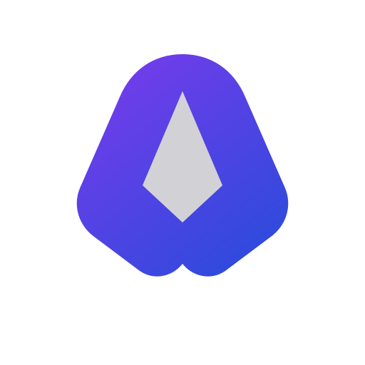
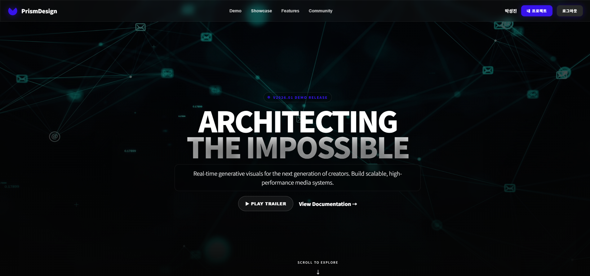
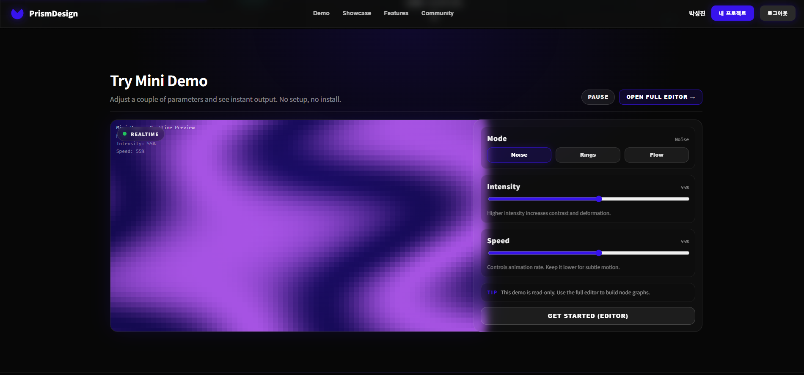
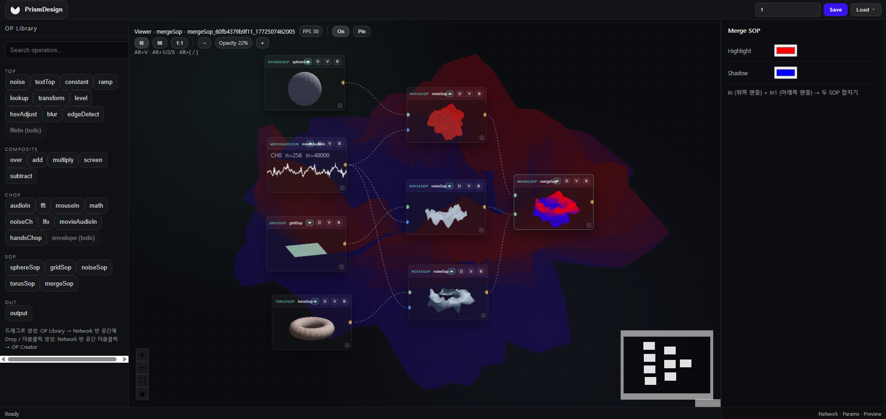
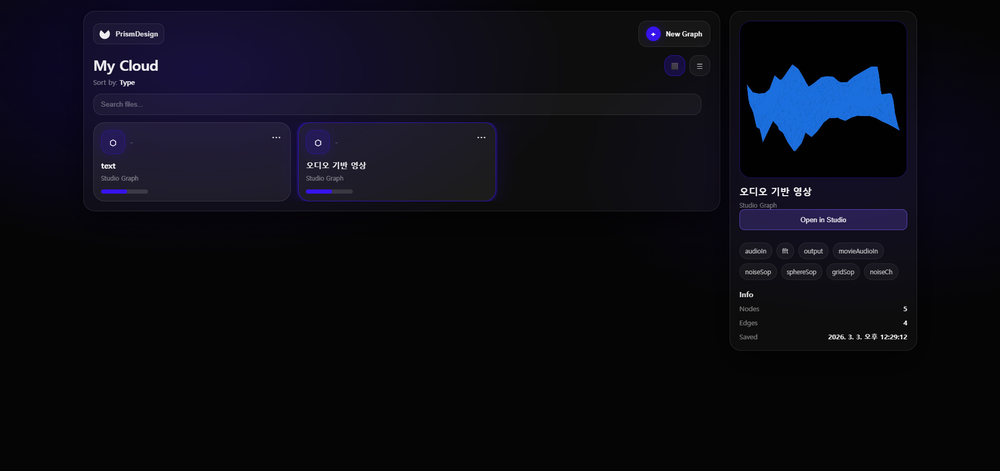

# PrismDesign

<p align="center">
  
</p>

<p align="center">
  <b>Browser-based node visual programming studio</b><br/>
  Inspired by TouchDesigner — connect <b>TOP</b> (2D textures) · <b>CHOP</b> (channel data) · <b>SOP</b> (3D geometry) operators into a graph and generate real-time visuals.
</p>

<p align="center">`
  <a href="#quick-start">Quick Start</a> ·
  <a href="#screenshots">Screenshots</a> ·
  <a href="#architecture">Architecture</a> ·
  <a href="#operator-model">Operators</a> ·
  <a href="#tech-stack">Tech Stack</a>
</p>

---

## Overview

**PrismDesign** is a web-based visual programming environment where users compose real-time media pipelines by wiring operators as nodes.

Key ideas:`

- **Operator graph**: Nodes are operators (TOP/CHOP/SOP). Edges define data flow.
- **Live preview**: Each node can render a mini preview; the graph produces a final output.
- **Persistence**: Graphs are saved/loaded via the backend with metadata + thumbnails.
- **Webcam interaction**: **Hands CHOP** tracks hand position/pinch gestures (MediaPipe) and exposes multi-channel outputs.

> Rendering backend: **Canvas 2D** (no WebGL). The project is intentionally optimized for predictable compatibility and fast iteration.

---

## Demo

If you generated a short demo GIF:

<p align="center">
  `
</p>

---

## Screenshots

### Landing / Showcase
<p align="center">
  
</p>

### Mini Demo (Read-only)
<p align="center">
  
</p>

### Studio (Node Graph Editor)
<p align="center">
  
</p>

### My Cloud (Saved Graphs)
<p align="center">
  
</p>

<details>
  <summary>Full size images</summary>
  
  
  
  
</details>

---

## Project Structure

```
touchdesign-fullstack/
├── frontend/     # Frontend (React + Vite)
└── server/   # Backend (Express) — save/load graphs + thumbnails
```

---

## Quick Start

Run in two terminals:

```bash
# Terminal 1 – Frontend (http://localhost:5173)
cd frontend
npm install
npm run dev

# Terminal 2 – Server (http://localhost:3001)
cd server
npm install
npm run dev
```

---

## Architecture

### Components

- **Graph Editor (ReactFlow)**  
  Node/edge interactions, selection, panning/zooming, and operator creation UX.

- **Runtime / Evaluator**  
  Evaluates the graph and propagates values along edges.  
  Typical responsibilities:
  - Topological scheduling / dependency ordering (or incremental evaluation)
  - Caching node outputs per frame (dirty-flag based recompute)
  - Type-aware connections (Texture / Channels / Geometry)

- **Preview Renderer (Canvas 2D)**  
  Real-time rendering loop (RAF).  
  Produces:
  - Node thumbnails / mini previews
  - Final output preview

- **Backend (Express)**  
  Stores graph JSON + metadata and supports listing/loading by id/name.

### Data Flow (High-level)

1. **Input nodes** inject values (e.g., audio/webcam/mouse/time).
2. Values flow through operator nodes (TOP/CHOP/SOP).
3. Output nodes render to preview canvases.
4. Save produces JSON + thumbnail metadata; Load recreates graph state.

---

## Operator Model

Each operator follows a common contract:

- **Inputs**: accepted input types (Texture / Channels / Geometry)
- **Outputs**: output type + shape (e.g., N channels, texture size, geometry mesh)
- **Params**: editable in the Inspector; persisted in graph JSON
- **Preview**: how to render a preview (thumbnail + node mini view)

### Operator Categories

| Category | Description | Typical Nodes |
|----------|-------------|---------------|
| **TOP** | 2D texture generation & compositing | Noise, Text, Transform, Composite… |
| **CHOP** | time-series channel data | LFO, Noise, FFT, Hands (webcam tracking) |
| **SOP** | 3D surface / geometry | Sphere, Noise (vertex displacement), Grid… |

### Real-time Binding

- **CHOP → SOP/TOP Binding**  
  CHOP channels can drive SOP/TOP parameters in real-time (e.g., amplitude → displacement).

- **Hands CHOP**  
  Uses MediaPipe to track hands and exposes multiple channels (position, pinch, etc.).

---

## Graph Storage

Graphs are persisted as local JSON files.

- Location: `server/graphs/`
- Includes: nodes, edges, operator params, thumbnail metadata

### API (reference)

> Actual routes may differ based on your server implementation — align with `server/README.md`.

- `GET /api/graphs` — list graphs
- `GET /api/graphs/:id` — load graph
- `POST /api/graphs` — save graph (optionally with thumbnail)

---

## Features

- **Node graph editing** — double click to create operators, drag to connect, select & inspect
- **Live preview** — RAF-based real-time preview per node and final output
- **Save/Load** — store named graphs with thumbnails
- **Webcam interaction** — Hands CHOP for gesture-driven visuals
- **Operator library** — searchable categorized operator list (TOP/CHOP/SOP)

---

## Performance & Limitations

- Canvas 2D rendering (no WebGL)
- FPS depends on:
  - number of nodes + preview resolution
  - frequency of recomputation (dirty flags vs full evaluation)
  - webcam + MediaPipe load for Hands CHOP

Optimization directions:

- Reduce preview resolution or disable mini previews per node
- Dirty-flag / partial evaluation
- OffscreenCanvas + Worker split (experimental)

---

## Roadmap

### P0 (Stabilize)
- [ ] Improve save/load robustness + thumbnail quality
- [ ] Expand core operator set (TOP/CHOP/SOP)
- [ ] Better parameter UX (grouping, ranges, presets)

### P1 (Productivity)
- [ ] Presets / templates for common graphs
- [ ] Keyframe/automation MVP for parameters
- [ ] Incremental evaluator optimization

### P2 (Scale)
- [ ] Optional rendering backend upgrade path (WebGL)
- [ ] Multi-graph tabs, stronger undo/redo, versioned graph history
- [ ] Shareable graph links / export bundles

---

## Documentation

- [server/README.md](server/README.md) — server API + running instructions

---

## Design

- [Figma — TouchDesign](https://www.figma.com/design/yO1oSzYQypry0ft3tmGKQl/TouchDesign?node-id=0-1&t=VN4ukxP2Jt4NNKwz-1)

---

## Contributing

PRs and issues are welcome.

- Bug reports: include reproduction steps + screenshots
- Feature requests: describe the workflow and expected behavior

---

## License

Choose a license (e.g., MIT) and add `LICENSE` at the repository root.
