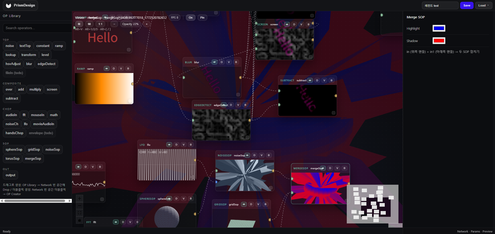

<h2 align="center">PrismDesign</h2>


<p align="center">
  
</p>

<p align="center">
  <b>브라우저 기반 노드 비주얼 프로그래밍 스튜디오</b><br/>
  TouchDesigner에서 영감을 받아 <b>TOP</b> 2D 텍스처 · <b>CHOP</b> 채널 데이터 · <b>SOP</b> 3D 지오메트리 오퍼레이터를 그래프로 연결하고, 실시간 비주얼을 생성할 수 있는 웹 기반 도구입니다.
</p>

<p align="center">
  Inspired by <a href="https://derivative.ca/">TouchDesigner</a>
</p>

<p align="center">
  <a href="#quick-start">Quick Start</a> ·
  <a href="#screenshots">Screenshots</a> ·
  <a href="#architecture">Architecture</a> ·
  <a href="#operator-model">Operator Model</a> ·
  <a href="#operators">Operators</a> ·
  <a href="#tech-stack">Tech Stack</a>
</p>

---

## Overview

**PrismDesign**은 사용자가 오퍼레이터 노드를 연결하여 실시간 미디어 파이프라인을 구성할 수 있는  
**웹 기반 비주얼 프로그래밍 환경**입니다.

핵심 개념은 다음과 같습니다.

- **오퍼레이터 그래프**: 노드는 TOP/CHOP/SOP 오퍼레이터이며, 엣지는 데이터 흐름을 정의합니다.
- **실시간 미리보기**: 각 노드는 미니 프리뷰를 렌더링할 수 있고, 전체 그래프는 최종 출력을 생성합니다.
- **저장 및 불러오기**: 그래프는 백엔드를 통해 메타데이터 및 썸네일과 함께 저장/불러오기할 수 있습니다.
- **웹캠 기반 인터랙션**: **Hands CHOP**은 MediaPipe를 활용하여 손 위치와 핀치 제스처를 추적하고, 이를 다중 채널 데이터로 제공합니다.

> 렌더링 백엔드: **Canvas 2D**  
> WebGL을 사용하지 않고, 예측 가능한 호환성과 빠른 반복 개발을 목표로 설계했습니다.

---

## Demo

### 오디오 반응형 원형 비주얼


<p align="center">
  
</p>

### Hands CHOP — MediaPipe 손 추적

<p align="center">
  
</p>

---

## Screenshots

### Landing / Showcase

<p align="center">
  
</p>

### Mini Demo — 읽기 전용 데모

<p align="center">
  
</p>

### Studio — 노드 그래프 에디터

<p align="center">
  
</p>

<p align="center">
  
</p>

### My Cloud — 저장된 그래프 목록

<p align="center">
  
</p>

<details>
  <summary>전체 이미지 보기</summary>
  
  
  
  
  
</details>

---

## Project Structure

```bash
touchdesign-fullstack/
├── frontend/  # Frontend (React + Vite)
└── server/    # Backend (Express) — 그래프 및 썸네일 저장/불러오기
```

---

## Team & Roles

| Member | GitHub | Role | Main Responsibilities |
|---|---|---|---|
| psj | [@ppsssj](https://github.com/ppsssj) | PM / Design / Frontend | 프로젝트 기획, 서비스 구조 설계, UI/UX 디자인, 주요 프론트엔드 화면 및 인터랙션 구현 |
| shindonghwagit | [@shindonghwagit](https://github.com/shindonghwagit) | Frontend / Backend | 프론트엔드 기능 구현, 백엔드 API 및 서버 로직 개발, 프론트엔드-백엔드 연동 |

---

## Quick Start

두 개의 터미널에서 각각 실행합니다.

```bash
# Terminal 1 – Frontend (http://localhost:5173)
cd frontend
npm install
npm run dev

# Terminal 2 – Server (http://localhost:3001)
cd server
npm install
npm run dev
```

---

## Architecture

### Components

- **Graph Editor — ReactFlow**  
  노드/엣지 상호작용, 선택, 이동, 확대/축소, 오퍼레이터 생성 UX를 담당합니다.

- **Runtime / Evaluator**  
  그래프를 평가하고, 엣지를 따라 값을 전달합니다.  
  주요 역할은 다음과 같습니다.

  - 위상 정렬 기반 실행 순서 관리 또는 증분 평가
  - 프레임 단위 노드 출력 캐싱
  - dirty-flag 기반 재계산
  - Texture / Channels / Geometry 타입 기반 연결 처리

- **Preview Renderer — Canvas 2D**  
  RAF 기반 실시간 렌더링 루프를 통해 프리뷰를 생성합니다.

  - 노드 썸네일 / 미니 프리뷰 생성
  - 최종 출력 프리뷰 렌더링

- **Backend — Express**  
  그래프 JSON과 메타데이터를 저장하고, id/name 기반 목록 조회 및 불러오기를 지원합니다.

### Data Flow — High-level

1. **입력 노드**가 오디오, 웹캠, 마우스, 시간 등의 값을 주입합니다.
2. 값은 TOP/CHOP/SOP 오퍼레이터 노드를 따라 흐릅니다.
3. 출력 노드는 결과를 프리뷰 캔버스에 렌더링합니다.
4. 저장 시 그래프 JSON과 썸네일 메타데이터를 생성하고, 불러오기 시 그래프 상태를 복원합니다.

---

## Operator Model

각 오퍼레이터는 공통된 구조를 따릅니다.

- **Inputs**: 입력 가능한 타입 — Texture / Channels / Geometry
- **Outputs**: 출력 타입 및 형태 — 예: N개 채널, 텍스처 크기, 지오메트리 메시
- **Params**: Inspector에서 수정 가능한 파라미터이며, 그래프 JSON에 저장됩니다.
- **Preview**: 썸네일 및 노드 미니뷰를 렌더링하는 방식입니다.

### Operator Categories

| Category | Description | Typical Nodes |
|----------|-------------|---------------|
| **TOP** | 2D 텍스처 생성 및 합성 | Noise, Text, Transform, Composite 등 |
| **CHOP** | 시계열 채널 데이터 처리 | LFO, Noise, FFT, Hands 웹캠 추적 등 |
| **SOP** | 3D 표면 및 지오메트리 처리 | Sphere, Noise 버텍스 변형, Grid 등 |

### Real-time Binding

- **CHOP → SOP/TOP Binding**  
  CHOP 채널 데이터는 SOP/TOP 파라미터를 실시간으로 제어할 수 있습니다.  
  예: amplitude → displacement

- **Hands CHOP**  
  MediaPipe를 활용해 손을 추적하고, 위치·핀치 등의 데이터를 여러 채널로 제공합니다.

---

## Operators

### TOP — Texture Operators / 텍스처·이미지 처리

| 노드 | 설명 |
|---|---|
| `noise` | 노이즈 패턴 텍스처 생성 — Perlin/simplex noise |
| `textTop` | 텍스트 문자열을 텍스처로 렌더링 |
| `constant` | 단색으로 채운 텍스처 생성 |
| `ramp` | 방향/형태별 그라디언트 텍스처 생성 |
| `lookup` | 다른 텍스처를 팔레트로 사용하여 색상 리매핑 |
| `transform` | 텍스처 이동 / 회전 / 스케일 변환 |
| `level` | 밝기 / 대비 / 감마 / 불투명도 조정 |
| `hsvAdjust` | HSV 기반 색조(H) / 채도(S) / 명도(V) 조정 |
| `blur` | 가우시안 블러 적용 |
| `edgeDetect` | 에지, 윤곽선 검출 필터 |
| `fileIn` *(todo)* | 이미지 / 동영상 파일 불러오기 |

### COMPOSITE — 두 텍스처 합성

| 노드 | 설명 |
|---|---|
| `over` | A를 B 위에 알파 블렌딩으로 겹치기 |
| `add` | 픽셀값 더하기 — 밝아짐 |
| `multiply` | 픽셀값 곱하기 — 어두워짐, 마스킹 |
| `screen` | 스크린 블렌드 — multiply 반전, 밝아짐 |
| `subtract` | 픽셀값 빼기 — 어두워짐, 차이 강조 |

### CHOP — Channel Operators / 채널·데이터 신호 처리

| 노드 | 설명 |
|---|---|
| `audioIn` | 마이크 오디오 실시간 입력 |
| `fft` | 오디오를 주파수 스펙트럼으로 분석 |
| `mouseIn` | 마우스 XY 위치 / 버튼 상태를 채널로 입력 |
| `math` | 채널에 곱셈 / 덧셈 등 수학 연산 적용 |
| `noiseCh` | 노이즈 기반 채널 신호 생성 |
| `lfo` | 저주파 오실레이터 — 사인파, 삼각파 등 주기 신호 |
| `movieAudioIn` | 동영상 파일에서 오디오 채널 추출 |
| `handsChop` | MediaPipe로 손 랜드마크 추적 데이터 입력 |
| `envelope` *(todo)* | 오디오 진폭 엔벨로프 검출 |

### SOP — Surface Operators / 3D 지오메트리 처리

| 노드 | 설명 |
|---|---|
| `sphereSop` | 구형 메시 생성 |
| `gridSop` | 격자 평면 메시 생성 |
| `noiseSop` | 지오메트리 버텍스에 노이즈 변형 적용 |
| `torusSop` | 토러스, 도넛형 메시 생성 |
| `mergeSop` | 여러 지오메트리를 하나로 병합 |

### OUT — 출력

| 노드 | 설명 |
|---|---|
| `output` | 네트워크의 최종 렌더 결과를 뷰어로 출력 |

---

## Graph Storage

그래프는 로컬 JSON 파일로 저장됩니다.

- 저장 위치: `server/graphs/`
- 포함 정보: nodes, edges, operator params, thumbnail metadata

### API — reference

> 실제 라우트는 서버 구현에 따라 달라질 수 있습니다.  
> 자세한 내용은 `server/README.md`와 맞춰 확인해야 합니다.

- `GET /api/graphs` — 그래프 목록 조회
- `GET /api/graphs/:id` — 특정 그래프 불러오기
- `POST /api/graphs` — 그래프 저장, 선택적으로 썸네일 포함

---

## Features

- **노드 그래프 편집** — 더블 클릭으로 오퍼레이터 생성, 드래그 연결, 선택 및 Inspector 확인
- **실시간 프리뷰** — RAF 기반 노드별 프리뷰 및 최종 출력 렌더링
- **저장/불러오기** — 이름과 썸네일이 포함된 그래프 저장
- **웹캠 인터랙션** — Hands CHOP을 활용한 제스처 기반 비주얼 제어
- **오퍼레이터 라이브러리** — TOP/CHOP/SOP 카테고리 기반 검색 가능한 오퍼레이터 목록

---

## Performance & Limitations

- Canvas 2D 렌더링을 사용합니다. WebGL은 사용하지 않습니다.
- FPS는 다음 요소에 영향을 받습니다.

  - 노드 개수와 프리뷰 해상도
  - 재계산 빈도 — dirty flags 방식 또는 전체 평가 방식
  - Hands CHOP 사용 시 웹캠 및 MediaPipe 부하

최적화 방향은 다음과 같습니다.

- 프리뷰 해상도 낮추기 또는 노드별 미니 프리뷰 비활성화
- dirty-flag 기반 부분 평가 적용
- OffscreenCanvas + Worker 분리 실험

---

## Documentation

- [server/README.md](server/README.md) — 서버 API 및 실행 방법

---

## Design

- [Figma — TouchDesign](https://www.figma.com/design/yO1oSzYQypry0ft3tmGKQl/TouchDesign?node-id=0-1&t=VN4ukxP2Jt4NNKwz-1)

